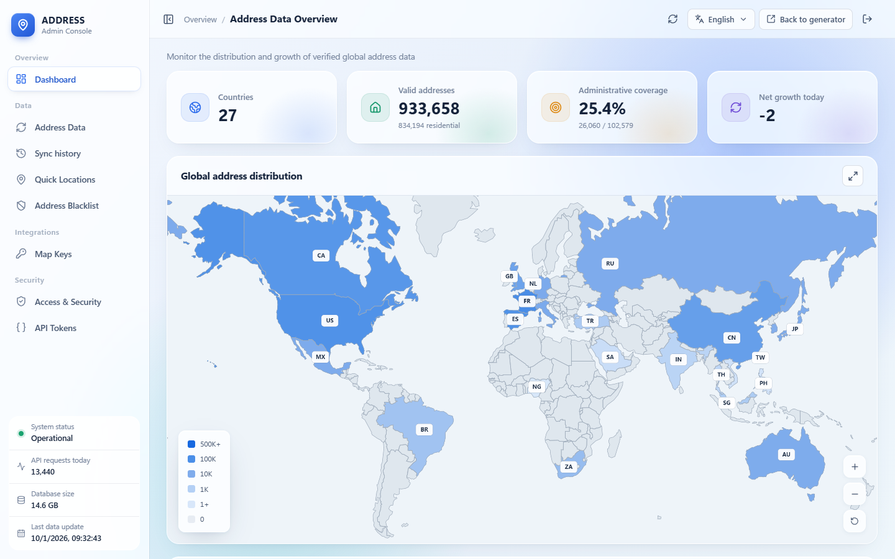
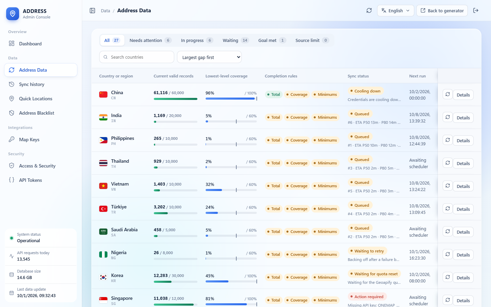
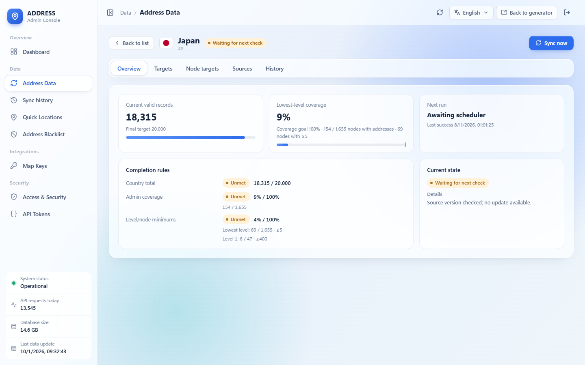
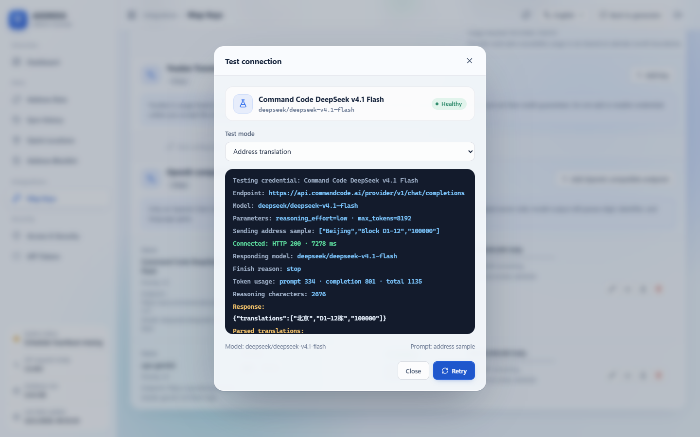

<div align="center">


# Address

**自託管的真實地址生成服務：資料來自官方登記與開放地圖，覆蓋 27 個國家和地區**

[English](README.md) · [简体中文](README.zh-CN.md) · 繁體中文

[](https://github.com/daimon3332/address/actions/workflows/ci.yml)
[](https://hub.docker.com/r/daimon23/address)
[](https://nodejs.org/)
[](https://www.postgresql.org/)
[](LICENSE)
[](https://address.333186.xyz)

</div>


## 簡介

Address 返回的是真實存在的地址，而不是隨機拼接的字串。每一條地址都來自官方地址登記、開放地圖資料或經過校驗的地理編碼結果，並帶有來源、精度和座標。缺失的欄位保持為空，不會被編造。

適合用於表單與物流流程測試、地址格式校驗、地理資料演示等需要「看起來真實、也確實真實」的地址場景。

## 特性

- **27 個國家和地區**：按各國真實的行政層級提供州省、城市、區縣和郵遞區號篩選；所選範圍沒有資料時直接報錯，不會悄悄換成別的地區。
- **來源可追溯**：中國使用住宅小區地址；其他國家同時提供門牌級和街道級地址，並明確標註精度與住宅證據。
- **十種顯示語言**：原文、英文、簡體中文、繁體中文、日語、韓語、德語、法語、西班牙語、葡萄牙語。
- **全自動同步**：後臺持續從各資料來源增量同步，自帶有限重試、指數退避、額度等待和來源耗盡判定，不會無休止地重複失敗任務。
- **管理後臺**：儀表盤、國家工作臺、同步歷史、快捷區域、平臺憑據、翻譯路由、訪問控制和 API 令牌。
- **開放 API**：Bearer 鑑權的 JSON API，支援單條與批次生成、地區搜尋、覆蓋查詢和地址翻譯，並提供 OpenAPI 3.1 描述。
- **一個檔案部署**：Docker Compose 一次拉起應用、PostgreSQL、遷移與同步服務，內部金鑰自動生成並持久化。

## 快速開始

### 前置條件

- Linux（AMD64 或 ARM64）
- Docker Engine 24+ 與 Docker Compose v2
- 4 GB 記憶體（首次同步大型國家建議 8 GB 以上）

### 使用 Docker Compose 部署

```bash
# 1. 建立部署目錄並下載 Compose 檔案
mkdir address && cd address
curl -fsSLo docker-compose.yml https://raw.githubusercontent.com/daimon3332/address/main/docker-compose.yml

# 2. 啟動全部服務
docker compose up -d

# 3. 確認服務就緒
docker compose ps
curl -fsS http://127.0.0.1:8787/api/v1/ready
```

啟動時會自動完成：

- 在當前目錄下建立 `data/`、`runtime/` 等持久化目錄；
- 生成資料庫密碼、配置加密金鑰和服務間令牌，儲存在 `data/secrets/`；
- 執行資料庫遷移，然後啟動 API 與自動同步服務。

### 首次登入

1. 瀏覽器開啟 `http://127.0.0.1:8787/admin/`，使用初始密碼 `admin` 登入；
2. 按提示立即修改管理員密碼；
3. 在「訪問與安全」中決定是否開啟前端訪問密碼；
4. 在「介面令牌」中建立 API 令牌，供外部程式呼叫。

> 想在首次啟動前就使用自定義密碼，可以在 `docker compose up -d` 之前設定 `ADMIN_INITIAL_PASSWORD`。

### 對外提供服務

API 預設只監聽本機 `127.0.0.1:8787`。正式環境請放在 HTTPS 反向代理之後，並在 Compose 目錄建立 `.env`：

```dotenv
ALLOWED_ORIGINS=https://address.example.com
TRUST_PROXY=true
COOKIE_SECURE=true
```

Nginx / Caddy 配置示例、升級、備份與恢復見[部署文件](docs/DEPLOYMENT.zh-TW.md)。

## 使用

### 網頁

開啟 `http://127.0.0.1:8787/`，選擇國家、地區和顯示語言即可生成地址。結果可複製、匯出、收藏，或直接在 Google 地圖 / 高德地圖中定位。

### API

```bash
curl -fsS "http://127.0.0.1:8787/api/v1/generate?country=US&city=Seattle" \
  -H "Authorization: Bearer YOUR_API_TOKEN"
```

```json
{
  "data": {
    "country": "US",
    "filters": { "city": "Seattle" },
    "filterMatchLevel": "exact",
    "result": {
      "address": {
        "formattedAddress": "4019 Aikins Avenue Southwest, Seattle, WA, 98116",
        "matchLevel": "premise",
        "propertyType": "residential",
        "coordinates": { "latitude": 47.567944, "longitude": -122.40706 }
      }
    }
  }
}
```

響應已省略部分欄位。`matchLevel` 表示地址精度（`street` / `premise` / `subpremise`），`propertyType` 只有在存在獨立住宅證據時才為 `residential`。

全部端點、參數和錯誤碼見 [API 文件](docs/API.zh-TW.md)。

### 平臺金鑰（可選）

沒有任何第三方金鑰也能執行，專案會使用無需授權的開放資料來源。中國地圖平臺、Google Geocoding、翻譯服務等金鑰只用於擴充特定國家的資料或啟用線上翻譯，在後臺「地圖金鑰」中新增即可。申請方式見 [API Key 配置](docs/API_KEYS.zh-TW.md)。

## 截圖

<table>
  <tr><th>管理後臺 · 儀表盤</th><th>管理後臺 · 國家工作臺</th></tr>
  <tr>
    <td></td>
    <td></td>
  </tr>
  <tr><th>國家詳情</th><th>翻譯憑據測試</th></tr>
  <tr>
    <td></td>
    <td></td>
  </tr>
  <tr><th>公開資料監控</th><th>中國地址生成</th></tr>
  <tr>
    <td></td>
    <td></td>
  </tr>
</table>

## 支援的國家和地區

| 區域 | 國家和地區 |
|---|---|
| 北美 | 美國 US、加拿大 CA、墨西哥 MX |
| 歐洲 | 英國 GB、德國 DE、法國 FR、義大利 IT、西班牙 ES、荷蘭 NL、俄羅斯 RU |
| 東亞 | 中國 CN、中國香港 HK、中國臺灣 TW、日本 JP、韓國 KR |
| 東南亞 | 新加坡 SG、馬來西亞 MY、泰國 TH、菲律賓 PH、越南 VN |
| 南亞 | 印度 IN |
| 大洋洲 | 澳大利亞 AU |
| 中東 | 土耳其 TR、沙烏地阿拉伯 SA |
| 南美 | 巴西 BR |
| 非洲 | 奈及利亞 NG、南非 ZA |

各國使用的資料來源、欄位來源與住宅證據見[資料來源說明](docs/data-sources.md)。

## 工作原理

```text
瀏覽器 ──► Astro + React 頁面
              │
              ▼
          Hono API ──► PostgreSQL（地址池、行政目錄、控制資料）
              │
              └─ 預構建的隨機/篩選索引、本地格式化與翻譯

同步服務 ──► 官方登記 / OpenStreetMap / Overture / 地圖平臺
              │  校驗來源、行政歸屬、語言與座標
              ▼
          以國家為單位的事務釋出 ──► PostgreSQL
```

一個國家要同時滿足三條規則才算同步完成：有效地址總量達標、最低一級行政區覆蓋率達標、各級行政區的最低數量達標。來源已被證明沒有新資料時，該國家會顯示「來源已達上限」，不再反覆進入執行佇列。

## 文件

| 文件 | 內容 |
|---|---|
| [部署](docs/DEPLOYMENT.zh-TW.md) | Docker Compose、反向代理、升級、備份恢復、常見問題 |
| [API](docs/API.zh-TW.md) | 鑑權、端點、參數、批次生成、錯誤碼 |
| [API Key](docs/API_KEYS.zh-TW.md) | 各平臺用途、申請步驟與後臺配置 |
| [開發](docs/DEVELOPMENT.zh-TW.md) | 本地開發、專案結構、測試與釋出檢查 |
| [資料來源](docs/data-sources.md) | 各國資料來源、釋出規則與同步流程 |
| [國家策略](docs/strategies/) | 每個國家的欄位、座標系、去重與驗證細節 |

## 許可證

原始碼以 [MIT](LICENSE) 許可釋出。各上游資料集保留其原有許可與署名要求，詳見[資料來源說明](docs/data-sources.md)。

## 社群

- [linux.do](https://linux.do)
